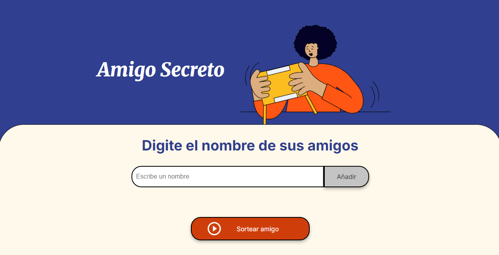
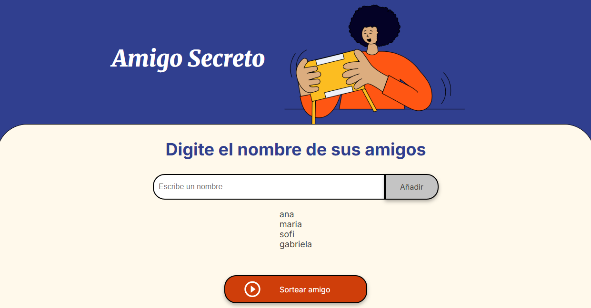
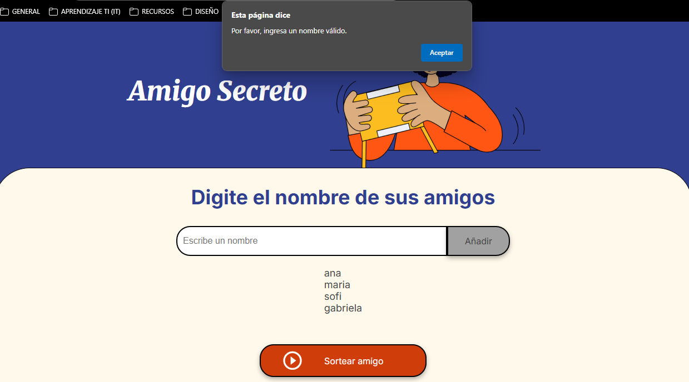
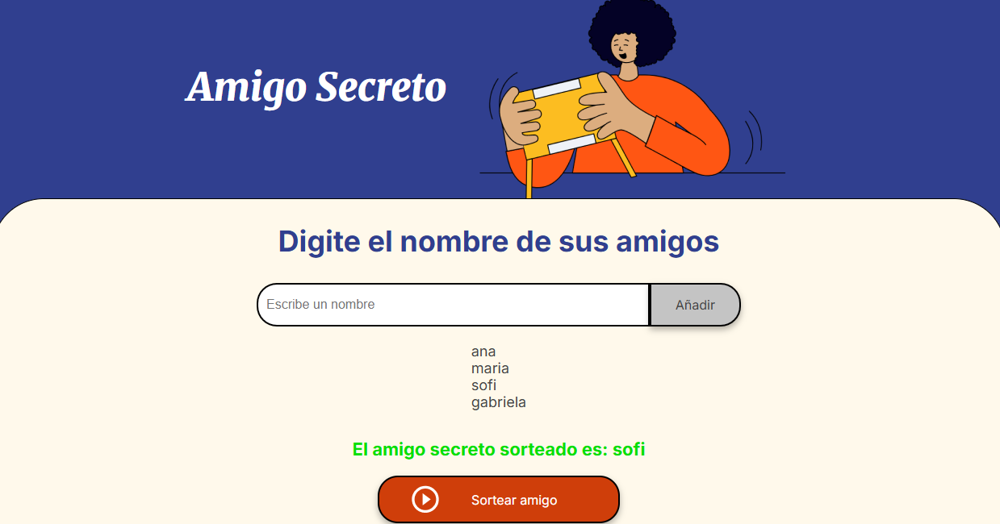

<h1>Amigo Secreto</h1>

Este es un proyecto simple en **JavaScript, HTML y CSS** que permite a los usuarios agregar nombres de amigos y realizar un **sorteo aleatorio** para determinar quién será el amigo secreto.  

## Funcionalidades
✅ Permite **ingresar nombres** de amigos.  
✅ **Valida** que el nombre no esté vacío ni repetido.  
✅ Muestra la **lista de amigos** agregados.  
✅ **Sortea un amigo secreto** aleatorio de la lista.  
✅ **Muestra el resultado** en pantalla de manera clara.  

---

## Capturas de Pantalla  

### 1️⃣ **Interfaz inicial del programa**  
  

### 2️⃣ **Añadiendo nombres a la lista**  
  

### 3️⃣ **Mensaje de error al ingresar un nombre vacío**  
  

### 4️⃣ **Mensaje de error al ingresar un nombre repetido**  
  

### 5️⃣ **Realizando el sorteo**  
  
---

## Instrucciones de Uso  

1️⃣ **Abre el archivo** `index.html` en un navegador.  
2️⃣ **Escribe nombres** en el campo de entrada y presiona "Añadir".  
3️⃣ **Presiona "Sortear amigo"** para seleccionar un nombre al azar.  
4️⃣ El resultado se mostrará en pantalla.  

---

## Tecnologías Utilizadas  
- **HTML5** → Para la estructura de la página.  
- **CSS3** → Para los estilos visuales.  
- **JavaScript (JS)** → Para la lógica del programa.  